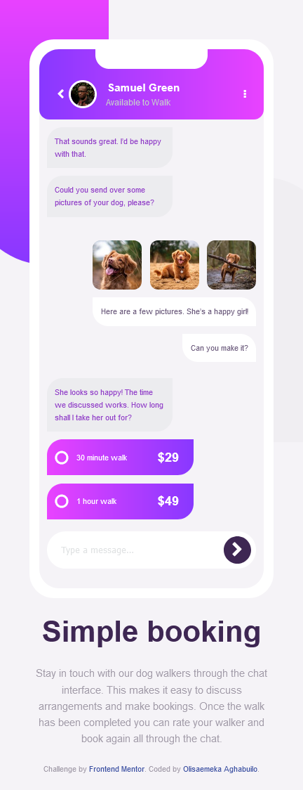
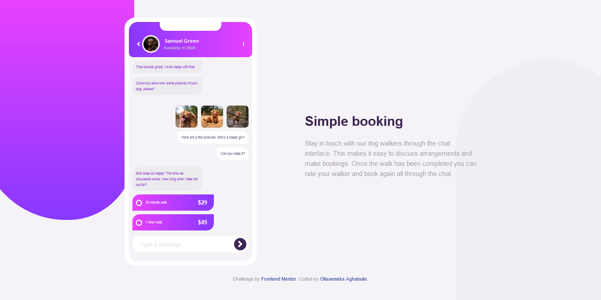

# Frontend Mentor - Chat app CSS illustration solution

This is a solution to the [Chat app CSS illustration challenge on Frontend Mentor](https://www.frontendmentor.io/challenges/chat-app-css-illustration-O5auMkFqY).

## Table of contents

- [Overview](#overview)
  - [Screenshot](#screenshot)
  - [Links](#links)
- [My process](#my-process)
  - [Built with](#built-with)
- [Author](#author)
- [Acknowledgments](#acknowledgments)

## Overview

### Screenshot

### Links

- Solution URL: [GitHub](https://github.com/olisa187/Chat-App-Css-Illustrator)
- Live Site URL: [Live site](https://olisa187.github-io/Chat-App-Css-Illustrator)

## My process

### Built with

- Semantic HTML5 markup
- CSS custom properties
- Flexbox
- CSS Grid
- Desktop-first workflow

## Author

- Frontend Mentor - [@olisa187](https://www.frontendmentor.io/profile/olisa187)
- Twitter - [@olisa187](https://www.twitter.com/olisa187)

## Acknowledgments

- frontendmentor
- @adramelech [css animation]